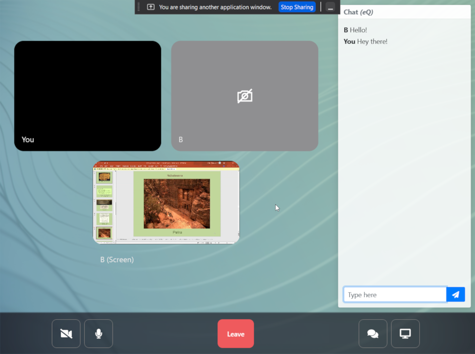

# lamsa-webrtc

This is a web conferencing application I created to learn more about WebRTC and WebSockets. The application features real-time video, audio, screen sharing and texting plus the ability to create, share and join rooms. Under the hood, lamsa-webrtc makes use of [WebRTC](https://developer.mozilla.org/en-US/docs/Web/API/WebRTC_API) and WebSockets to coordinate and connect peers over the network.

## Screenshots

## Project structure
It is not the most polished thing I have written, but I am sure you can manage your way through. In this repo I have provided two version:
1. A proof-of-concept with simply two files `server.js` and `client.html` available in the root of this repo demonstrating WebRTC capabilities + raw WebSockets.
2. A more polished version residing at `/server` and `/client` directories respectively. The server uses Express + socket.io for room management and WebRTC signaling, while the client uses React and socket.io client.

## Setup and running
To setup the project locally:
1. run `yarn install` in both `/server` and `/client`. 
2. `yarn run dev` in `/server`
3. `yarn run start` in `/client`

Visit localhost:3000 to access the client, create a room and enjoy :)

## Features
- Real-time peer-to-peer video, audio, screen sharing and texting.
- You can create rooms, share room code and get your friends to join your room.
- Meaningful, color-coded server logs for most events. Works great to see how things work under the hood.
- Adaptive tiling system for two, three, four, and 5+ participants. My favorite feature 😅
- Mobile responsive.
- A cool animated gradient background. 😉
- Bell sound when someone joins your meeting. 😎

## Limitations
- Since it is a P2P application, you inherently need lots of bandwidth and RAM to comfortably join rooms with 5+ participants.
- You might have issues with participants over other LANs since some NAT configurations break WebRTC. It is recommended to use a TURN/STUN server to mitigate NAT issues.
- The Leave room button is just cosmetic. Just close the tab to leave.
- No room security. Anyone can join any room if they know its code. Easy to implement though.
- Few responsivity bugs here and there.
- Lack of visual indicators for mute/camera off.

## What's next?
This was enjoyable to build. Warm up my sockets and React while play around with browser APIs including WebRTC, WebSockets, and MediaStream; however, I am not interesting in pushing this project further for several reasons. Primarily, this project has served its purpose which was purely educational.

If you are interested feel free to fork and add new cool features.

## Resources:
Can not find all resources since I am writing this README much much later than I originally wrote this repo. But I read, learnt and copy pasted from lots of places:
- MDN docs.
- webrtc.org.
- socket.io documentation.
- stackoverflow (ofc).
- An old, interesting YouTube video from Google introducing WebRTC.
- Lots of old WebRTC articles.
- And many more...
